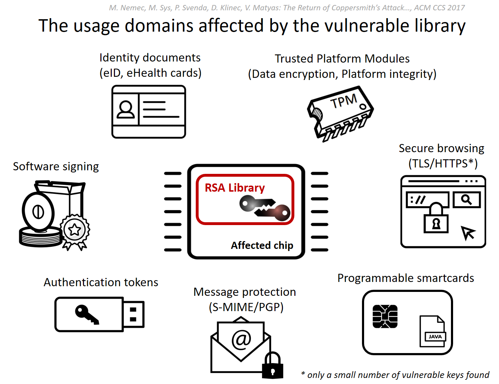

# Public disclosure: Vulnerable RSA generation CVE-2017-15361

## TLDR

A newly discovered vulnerability in generation of RSA keys used by a software library adopted in cryptographic smartcards, security tokens and other secure hardware chips manufactured by Infineon Technologies AG allows for a practical factorization attack, in which the attacker computes the private part of an RSA key. The attack is feasible for commonly used key lengths, including 1024 and 2048 bits, and affects chips manufactured as early as 2012, that are now commonplace. Assess your keys now with the provided
[offline and online detection tools](https://crocs.fi.muni.cz/private/petrs/roca#mitigation_and_workarounds) and
contact your vendor if you are affected. Major vendors including Microsoft, Google, HP, Lenovo, Fujitsu already
released the software updates and guidelines for a mitigation. Full details including the factorization method
will be released in 2 weeks at the [ACM CCS conference](https://www.sigsac.org/ccs/CCS2017) as
'The Return of Coppersmith's Attack: Practical Factorization of Widely Used RSA Moduli' (ROCA) research paper.

## Description of the vulnerability

A security vulnerability was found in the implementation of RSA keypair generation in a cryptographic library used in a wide range of cryptographic chips produced by Infineon Technologies AG. The product is also integrated in authentication, signature and encryption tokens of other vendors and chips used for Trusted Boot of operating systems. The vulnerability is present in NIST FIPS 140-2 and CC EAL 5+ certified devices since at least the year 2012.

 
The algorithmic vulnerability is characterized by a specific structure of the generated RSA primes, which makes factorization of commonly used key lengths including 1024 and 2048 bits practically possible. Only the knowledge of a public key is necessary and no physical access to the vulnerable device is required. The vulnerability does NOT depend on a weak or a faulty random number generator - all RSA keys generated by a vulnerable chip are impacted. The attack was practically verified for several randomly selected 1024-bit RSA keys and for several selected 2048-bit keys.  

The specific structure of the primes in question allows for a fast detection of vulnerable keys, even in very large datasets. This property is useful for mitigation (users can assess own keys for vulnerability), but also for potential attackers (keys vulnerable to factorization can be pre-selected, without undergoing time-consuming factorization attempts).
The worst cases for the factorization of 1024 and 2048-bit keys are less than 3 CPU-months and 100 CPU-years, respectively, on a single core of a common recent CPU, while the expected time is half of that of the worst case. The factorization can be easily parallelized on multiple CPUs. Where //k// CPUs are available, the wall time required for the attack will be reduced //k-times// - allowing for practical factorization in order of hours or days. The worst-case price of the factorization on an Amazon AWS c4 computation instance is $76 for the 1024-bit key and about $40,000 for the 2048-bit key. 

The difficulty of the factorization attack is not the same for all key lengths and is NOT strictly increasing (some longer keys may take less time to factorize than other shorter ones). The following key length ranges are now considered practically factorizable (time complexity between hours to 1000 CPU years at maximum): 512 to 704 bits, 992 to 1216 bits and 1984 to 2144 bits. Note that 4096-bit RSA key is not practically factorizable now, but may become so, if the attack is improved.  

The time complexity and cost for the selected key lengths (Intel E5-2650 v3@3GHz Q2/2014):
  * 512 bit RSA keys ~ 2 CPU hours (the cost of $0.06);
  * 1024 bit RSA keys ~ 97 CPU days (the cost of $40-$80);
  * 2048 bit RSA keys ~ 140.8 CPU years, (the cost of $20,000 - $40,000).

The vulnerability was found by a close inspection of a large number of RSA keys generated and exported from the manufacturer smartcards by researchers at CRoCS laboratory, Masaryk University, Enigma Bridge and Ca' Foscari University. The full results will be presented at an academic ACM Conference on Computer and Communications Security (ACM CCS '17) starting from October 30th. 

The vulnerability was disclosed to Infineon Technologies AG, following the responsible disclosure principle, in the first week of February with agreement of an 8 month period before a public disclosure. We cooperated with the manufacturer and other affected parties to help evaluate and mitigate this vulnerability during this period. Major vendors including Microsoft, Google, HP, Lenovo, Fujitsu already released the software updates and guidelines for a mitigation. We are now notifying general public and releasing tools for assessmnet of the individual keys. 

## Impact
A remote attacker can compute an RSA private key from the value of a public key. The private key can be misused for impersonation of a legitimate owner, decryption of sensitive messages, forgery of signatures (such as for software releases) and other related attacks.   

The actual impact of the vulnerability depends on the usage scenario, availability of the public keys and the lengths of keys used. We found and analyzed vulnerable keys in various domains including electronic citizen documents, authentication tokens, trusted boot devices, software package signing, TLS/HTTPS keys and PGP. The currently confirmed number of vulnerable keys found is about 760,000 but possibly up to two to three magnitudes more are vulnerable. The details will be presented in two weeks at the ACM CCS conference.

The vulnerable chips are pervasive and not necessarily sold directly by Infineon Technologies AG, as the chips can be embedded inside devices of other manufacturers. 

## Detection tools, mitigation and workarounds {#mitigation}

The first step is to detect if you use a chip with the vulnerable library. As the vulnerability is present in the on-chip software library and not limited just to a particular batch of hardware, the only reliable way is to generate an RSA keypair on the device and test the public key by the provided tools (see below). It is recommended to test also the keys already in use. We believe the tools are very accurate - it is highly unlikely that a secure key would be flagged, as well as that a vulnerable key would be missed. 

We provide the following tools:
  * **Offline testers**: Python/Java/C++ applications and tutorials (https://github.com/crocs-muni/roca). We release all offline tools under the MIT license so it can be embedded into other testing applications and services. 
  * **Online testers**: Upload public key to https://keychest.net/roca or https://keytester.cryptosense.com to test your key.
  * **Email S-MIME/PGP tester**: Send a signed email to <roca@keychest.net> to obtain an automatic email response with the analysis of the signing key vulnerability.  
  
If a vulnerable key is found, then you should contact your device vendor for further advice.

The following general advices may apply:
  * Apply the software update if available.
  * Replace the device with one without the vulnerable library.
  * Generate a secure RSA keypair outside the device (e.g., via the OpenSSL library) and import it to the device. We are not aware of any vulnerability in connection with the actual use of the key, only the generation phase has a confirmed vulnerability.
  * Use other cryptographic algorithm (e.g., ECC) instead of RSA on affected devices.
  * Apply additional risk management within your environment, if the RSA key in use is detected as vulnerable.
  * Use key lengths which are not currently impacted (e.g., 3936 bits) by our factorization method. Be aware: use this specific mitigation only as a last resort, as the attack may be improved. 
  
## Team
The vulnerability was discovered by Slovak and Czech security researchers from the Centre for Research on Cryptography and Security at Masaryk University, Czech Republic; Enigma Bridge Ltd, Cambridge, UK; and Ca' Foscari University of Venice, Italy.

## Updates
  * 2nd of November 2017 - Presentation of all details at the ACM CCS conference (to come)
  * 16th of October 2017 - The initial version of the public disclosure published 
  * May to October 2017 - Cooperation with the manufacturer and other affected parties to help evaluate and mitigate the vulnerability
  * 1st of February - The vulnerability disclosed to Infineon Technologies AG
  * End of January - The vulnerability found 

## Q&A

**Q:** Is the RSA algorithm insecure in general after the disclosure of this vulnerability?\\
**A:** No. If the RSA primes are generated as a truly random numbers, our method cannot be applied. For example, keys generated by the OpenSSL library are NOT affected.

**Q:** How can I be sure that my keys are not affected?\\
**A:** Run one of the provided detection tools ( [Mitigation] (#mitigation) ). We believe that the tool has practically no false positives (if a key is flagged as vulnerable, it is vulnerable) and no false negatives (if a key is not detected as vulnerable, it is safe against our attack).

**Q:** How can I mitigate the vulnerability?\\
**A:** Contact your vendor and ask for help, apply the patch if available. 

**Q:** There was a recent (10th of October) security advisory regarding Trusted Platform Modules (TPM) by Microsoft, Google and other vendors. Is this connected to the vulnerability announced in this disclosure?\\  
A: Yes, this is the direct result of the vulnerability found as the affected devices are using TPMs with the vulnerable library.

**Q:** Are ECC keys generated on the affected chips vulnerable?\\
**A:** No. We found no vulnerability in the ECC key generation of the vulnerable library. 

**Q:** The Coppershmith's attack was already used to factorize keys from cryptographic smartcards. Is this an instance of the same vulnerability?\\
**A:** No, this one is different. Daniel J. Bernstein, Yun-An Chang, Chen-Mou Cheng, Li-Ping Chou, Nadia Heninger, Tanja Lange and Nicko van Someren in 2013 devised a method to exploit flawed random number generator in Taiwanese citizen cards, present due to a manufacturing defect in some of the cards https://smartfacts.cr.yp.to/smartfacts-20130916.pdf. This new vulnerability applies to all chips equipped with the vulnerable library.

**Q:** How was the vulnerability found?\\
**A:** We analyzed the statistical properties of a large number of RSA keys generated and extracted from various smartcards during the previous research work published at USENIX Security 2016 conference (https://www.usenix.org/conference/usenixsecurity16/technical-sessions/presentation/svenda). No reverse engineering of the chip or the library was performed.

**Q:** Are FIDO U2F authentication tokens affected?\\
**A:** No. The U2F specifications only allow for ECC-based authentication.

## Technical references

  * Infineon, Information on TPM firmware update for Microsoft Windows systems https://www.infineon.com/cms/en/product/promopages/tpm-update/?redirId=59160
  * Microsoft Vulnerability in TPM could allow Security Feature Bypass: https://portal.msrc.microsoft.com/en-US/security-guidance/advisory/ADV170012
  * Google, The Chromium project Trusted Platform Module firmware vulnerability: https://sites.google.com/a/chromium.org/dev/chromium-os/tpm_firmware_update

